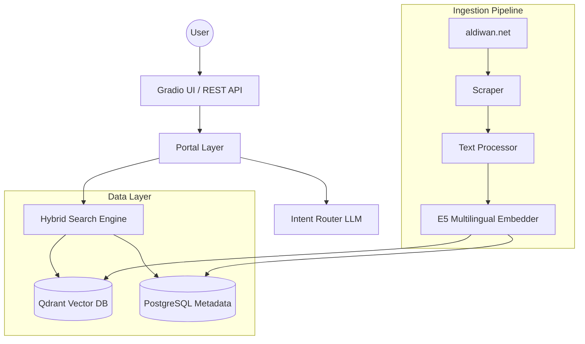

# Diwanic System Architecture

## 1. System Overview
Diwanic is a production-grade Retrieval-Augmented Generation (RAG) system designed for semantic search over large-scale Arabic poetry corpora. It decouples data ingestion, storage, and retrieval to ensure scalability, reliability, and ease of maintainability.

## 2. Architecture Diagram (C4 Context/Container)

## 3. Core Components

### Portal Layer (Bridge)
Acts as the thin entry point for both the Gradio UI and REST API. It handles lazy initialization of services and provides a consistent interface for the application frontends.

### Intent Router (LLM Orchestrator)
Instead of executing raw queries, Diwanic uses an LLM to "route" the intent:
- **`analyze_query`**: Extracts entities (poet, era, meter) and semantic themes.
- **`SearchPlan`**: Generates a structured JSON object used to guide the retrieval engine.

### Hybrid Search Engine
Our core retrieval strategy combines two search paradigms:
1. **Semantic Search**: Vector-based retrieval using the `multilingual-e5-small` model to find verses conceptually similar to the query.
2. **Keyword Fallback**: Synchronous SQL `LIKE` queries against `PostgreSQL` for exact matches (e.g., specific poet names or titles) when vector retrieval is unnecessary or unavailable.

### Data Access (Repository Pattern)
We decouple business logic from database implementation using the **Repository Pattern**.
- `diwanic.storage.repository.DiwanicRepository` handles all SQL operations.
- This allows us to swap database backends (or switch between sync/async drivers) without modifying the search engine code.

## 4. Data Flow

### Ingestion (Offline Pipeline)
1. **Scraping**: Fetches poems from `aldiwan.net`.
2. **Preprocessing**: Normalizes Arabic diacritics and splits text into individual verses.
3. **Embedding**: Uses `PoemEmbedder` to generate 384-dim vectors.
4. **Storage**: Metadata (title, era, poet) is committed to `PostgreSQL`, while vectors are pushed to `Qdrant`.

### Retrieval (Online Pipeline)
1. **Query**: User provides a query.
2. **Routing**: LLM produces a structured `SearchPlan`.
3. **Search**: Engine performs retrieval in `Qdrant` (semantic) and `PostgreSQL` (metadata filtering).
4. **Ranking**: Results are RRF (Reciprocal Rank Fusion) scored or returned based on hybrid confidence scores.
5. **Display**: UI hydrates the result list with full poem content from the `PostgreSQL` store.

## 5. Design Principles
- **Lazy Initialization**: Database and AI services are instantiated only on demand to keep the system responsive.
- **Fail-Safe Design**: The search engine includes automated fallback logic to ensure users always receive *some* result, even if external services (Qdrant/DeepSeek) are temporarily unreachable.
- **Decoupling**: The storage layer is strictly separated from the business logic, allowing for future migrations to different search backends.
