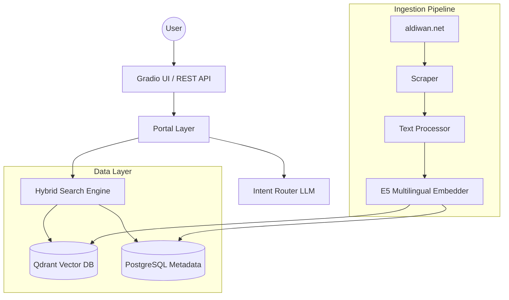

# Diwanic System Architecture

## 1. System Overview
Diwanic is a production-grade Retrieval-Augmented Generation (RAG) system designed for semantic search over large-scale Arabic poetry corpora. It decouples data ingestion, storage, and retrieval to ensure scalability, reliability, and ease of maintainability.

## 2. Architecture Diagram (C4 Context/Container)

## 3. Core Components

### Portal Layer (Bridge)
Acts as the thin entry point for both the Gradio UI and REST API. It handles lazy initialization of services and provides a consistent interface for the application frontends.

### Intent Router (LLM Orchestrator)
Instead of executing raw queries, Diwanic uses an LLM to "route" the intent:
- **`analyze_query`**: Extracts entities (poet, era, meter) and semantic themes.
- **`SearchPlan`**: Generates a structured JSON object used to guide the retrieval engine.

### Hybrid Search Engine
Our core retrieval strategy combines two search paradigms:
1. **Semantic Search**: Vector-based retrieval using the `multilingual-e5-small` model to find verses conceptually similar to the query.
2. **Keyword Fallback**: Synchronous SQL `LIKE` queries against `PostgreSQL` for exact matches (e.g., specific poet names or titles) when vector retrieval is unnecessary or unavailable.

### Data Access (Repository Pattern)
We decouple business logic from database implementation using the **Repository Pattern**.
- `diwanic.storage.repository.DiwanicRepository` handles all SQL operations.
- This allows us to swap database backends (or switch between sync/async drivers) without modifying the search engine code.

## 4. System Flow & Responsible Files

| Flow | Responsible Files | Purpose |
| :--- | :--- | :--- |
| **Ingestion** | `diwanic/pipelines/flows/full_pipeline_flow.py` | Orchestrates scraper/embedder/vectorstore. |
| **Search (UI)** | `run.py` → `diwanic/app/portal.py` | UI entry point calling portal search interface. |
| **Search (API)** | `run_api.py` → `diwanic/api/main.py` | API entry point calling portal search interface. |
| **Hybrid Search**| `diwanic/search/engine.py` | Integrates Qdrant (semantic) + Postgres (keyword). |
| **Database** | `diwanic/storage/repository.py` | Single interface for Postgres operations. |
| **Embeddings** | `diwanic/embeddings/generator.py` | Multilingual E5 batch embedding with disk cache. |

## 5. Technology Stack
- **FastAPI**: Lightweight, high-performance REST API.
- **Gradio**: Rapid UI development for search exploration.
- **SQLAlchemy (Async)**: Decoupled DB access using the Repository Pattern.
- **Qdrant**: Vector database for verse-level semantic search.
- **Sentence-Transformers**: Multilingual embedding model for Arabic.
